# WNBA CourtCast Dataset Pipeline

## Project description

Lightweight but end-to-end toolkit for training tiny-object YOLOv8 detectors, converting CVAT exports into MOT-format splits, running BoT-SORT/ByteTrack tracking, projecting tracks to court coordinates, and mining basketball events (passes, dribbles, shots). Includes court homography estimation, jersey-based team clustering, and evaluation utilities.


**Pipeline overview:**

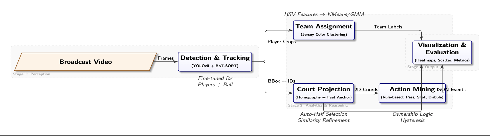

## Repository layout

- `Final/src/yolo`: Training, inference, and evaluation entrypoints for YOLOv8.
- `Final/src/track`: Utilities to build MOT mirrors, run trackers, convert Ultralytics outputs to MOT, and score with TrackEval.
- `Final/src/court`: Homography estimation, court projection, and visual overlays.
- `Final/src/team`: Jersey crop sampling, clustering, and inspection tools.
- `Final/src/rules` and `Final/src/eval`: Possession/action mining and event evaluation helpers.
- `Final/configs`: YOLO dataset/hyp settings and tracker configs.
- `Final/commands_updated.sh`: Canonical run commands for training, data prep, tracking, and evaluation.
- `Final/requirements.txt`: Python dependencies.
- Data expectations: images and MOT trees under `Final/data`, run artifacts under `Final/results` and `Final/runs` (create as needed).

## Setup instructions

1. Install Python 3.10+ with CUDA-enabled PyTorch for training/tracking.
2. From the repo root, install dependencies:
```bash
   pip install -r Final/requirements.txt
```
3. Ensure Ultralytics CLI `yolo` is on PATH (installed by the dependency above).
4. Populate data paths expected by configs (e.g., `Final/data/dataset/images/{train,val_fixed}`, `Final/data/meta/cvat_exports`, `Final/data/meta/mot`).

## How to run the code (see `Final/commands_updated.sh`)

**Train YOLOv8 small-object model (multi-GPU example):**
```bash
CUDA_VISIBLE_DEVICES=0,1,2,3,4,5,6,7 python3 src/yolo/train_yolov8.py --device 0,1,2,3,4,5,6,7 --amp false
```

- You might access the pre-trained model here: https://www.kaggle.com/models/weijiahan/wnba-yolov8-player-ball-detection/
- You might access the original dataset here: https://www.kaggle.com/datasets/weijiahan/wnba-yolov8-dataset

**Build MOT mirrors from frame lists:**
```bash
python3 src/track/build_mot_from_lists.py --split val --frame_list data/meta/splits/val.txt --gt_master data/meta/cvat_exports/val_gt.txt --images_root data/dataset/images --fps 2
```

**Run trackers (players+ball):**
```bash
python3 src/track/run_tracker.py --split val --tracker botsort --classes 0,1 --conf 0.50 --iou 0.60 --name botsort_2ps
```

**Convert Ultralytics outputs to MOT and evaluate:**
```bash
python3 src/track/ultra_to_mot.py --ultra_root results/track --tracker botsort --split val --mot_out results/track/botsort/val --mot_gt data/meta/mot

/usr/bin/python3 src/track/eval_track_internal.py --mot_gt data/meta/mot/val --res_root results/track/botsort/val --class_id 1
```

**Mine actions (pass/shot/dribble) after tracking:**
```bash
python3 src/rules/rules_actions.py --split val --tracker botsort --player_cls 0 --ball_cls 1 --own_px 143.5 --own_hys 20 --min_hold_f 1 --near_px 50 --far_px 80 --pass_air_min 0 --pass_air_max 4 --pass_travel 60 --debounce_f 3 --shot_air 2 --shot_speed 2 --ball_smooth 3
```

## Additional assets/configuration

- YOLO data/hyp configs under `Final/configs` (e.g., `dataset.yaml`, `hyp_smallobj.yaml`).
- Tracker settings under `Final/configs/tracker/{bytetrack.yaml,botsort.yaml}`.
- Homography inputs: CVAT XML clicks and outputs stored under `Final/data/meta/homography`.
- Team crops and assignments: `Final/data/meta/team_crops`, `Final/data/meta/team_assign`.
- Event labels for evaluation (if available): `Final/data/meta/actions_gold`.

## Known issues / limitations

- Data paths are fixed to the `Final/data` layout; adjust CLI flags if your dataset lives elsewhere.
- Training and tracking expect CUDA GPUs; CPU fallback is slow and not recommended.
- Some utilities rely on external annotations (homography clicks, team seeds, gold events) which are not bundled.
- TrackEval must be installed/importable in the active environment for evaluation scripts.

## Results & Plots

**Precision–Recall curves (players vs ball) and training curves:**

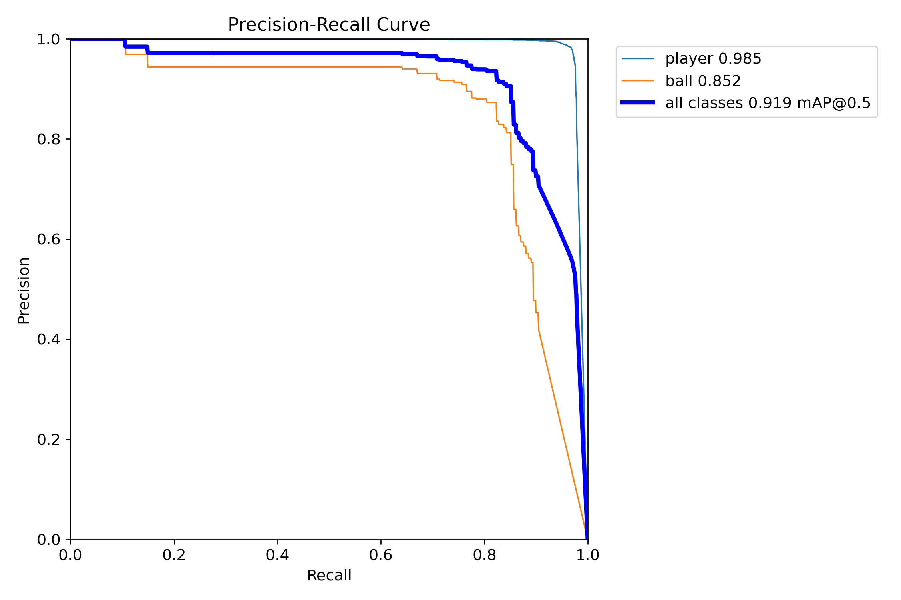
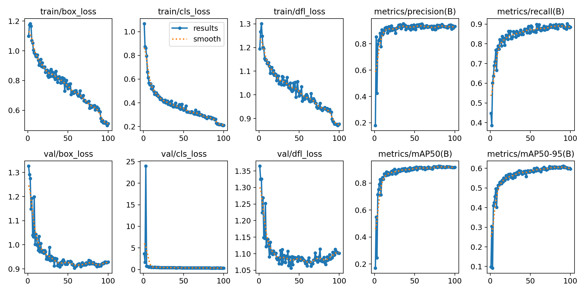

**Detection confusion matrix:**

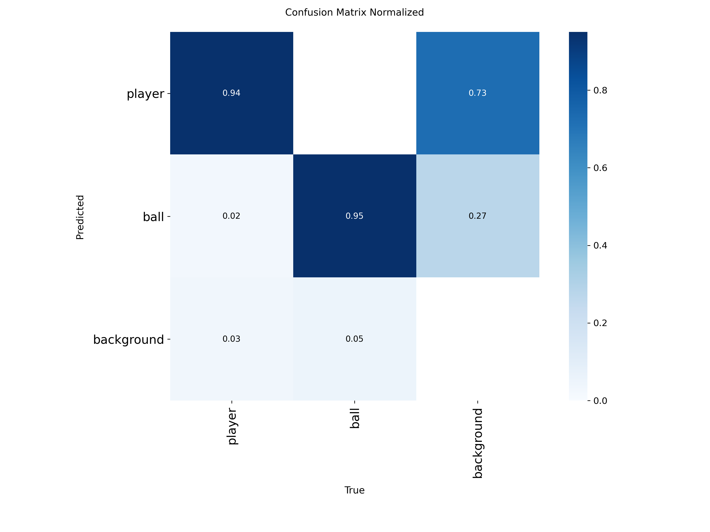

**Dataset stats and box distributions:**

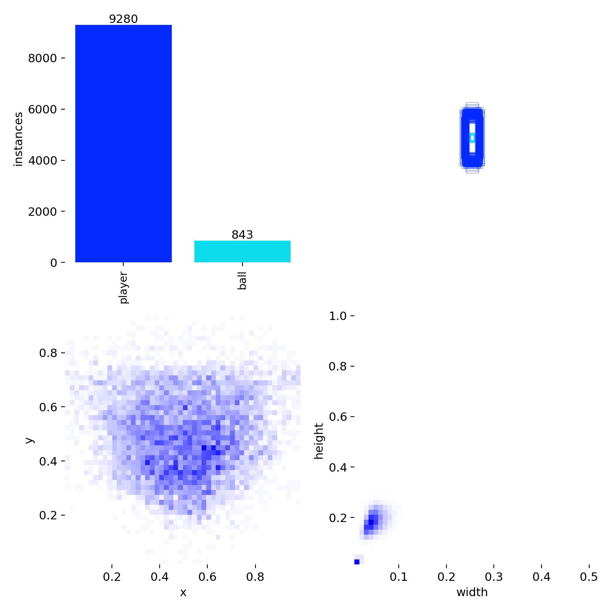

**Tracking visual examples:**

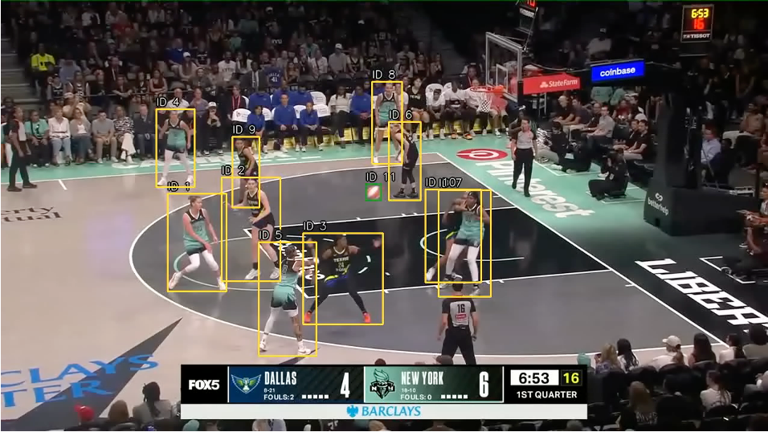


**Tracking metrics (per-sequence IDF1/IDR/IDP):**

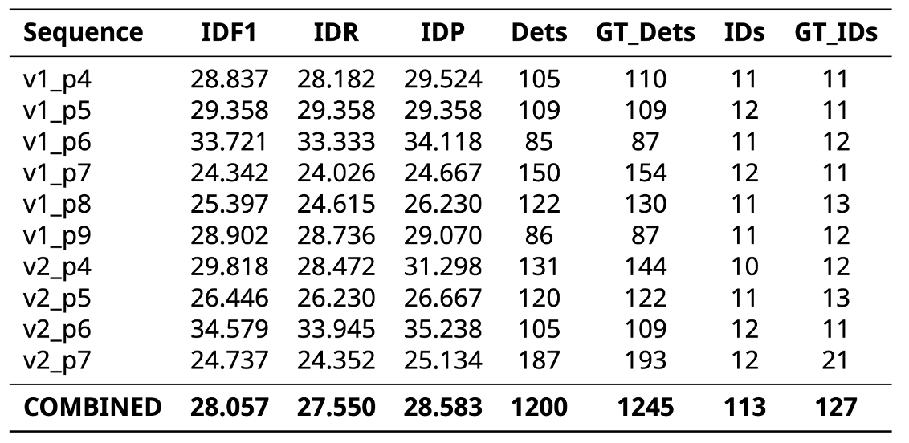

**OOB frame analysis (2 FPS and 10 FPS splits):**

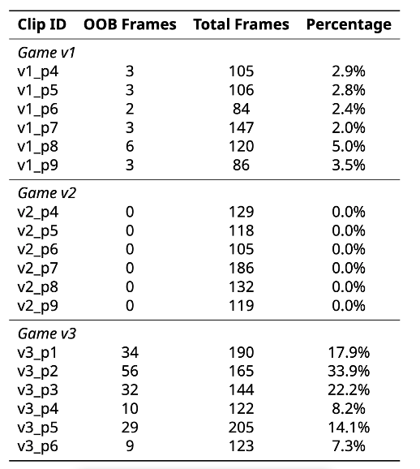
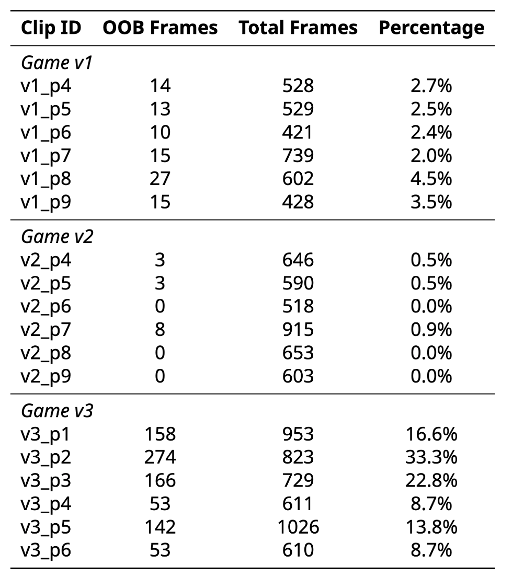

**Team assignment diagnostics:**

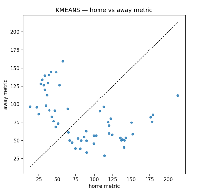
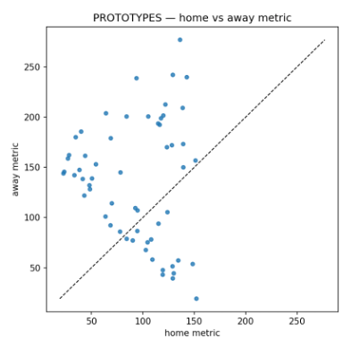

**Court projection and heatmaps:**

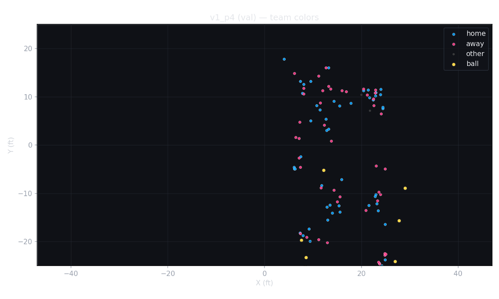


**Event mining metrics (two settings):**


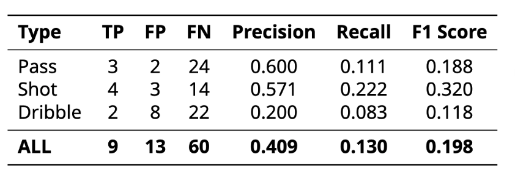

